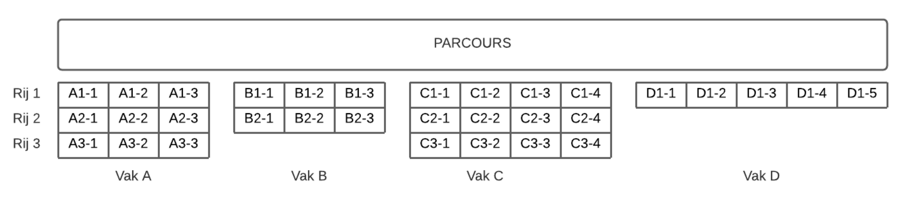

# Opdracht: Visitors Placement Tool voor Events

## Doel
Ontwikkel een applicatie waarmee een organisator bezoekers efficiënt kan plaatsen langs een parcours bij een evenement. De tool wijst elke bezoeker een stoel toe, rekening houdend met groepssamenstelling, leeftijd, en de indeling van vakken en rijen.

## Beschrijving
De "Visitors Placement Tool" is bedoeld om bezoekers (individueel of in groepen) te plaatsen op stoelen in vakken langs een parcours. Elk evenement heeft een unieke indeling van vakken, rijen en stoelen. De applicatie houdt rekening met obstakels, groepssamenstelling, leeftijden en zorgt voor een optimale plaatsing van bezoekers.

## Functionaliteiten
1. **Indeling in Vakken**
    - Elk vak kan 1 tot 3 rijen bevatten; alle rijen in een vak zijn even lang.
    - Een rij bevat 3 tot 10 stoelen.
    - Elke stoel heeft een unieke code: vakletter, rijnummer, stoelnummer (bijv. A1-2).

2. **Bezoekersregistratie**
    - Bezoekers melden zich individueel of in groepen aan.
    - Een bezoeker is een volwassene of een kind (t/m 12 jaar bij aanvang evenement).
    - Nieuwe bezoekers registreren zich met naam en geboortedatum en krijgen een uniek nummer.
    - Elke groep krijgt een uniek groepsnummer per evenement.

3. **Toegang en Plaatsing**
    - Toegang op basis van aanmeldingsdatum (first come, first serve).
    - Te laat aangemelde bezoekers of bij overschrijding van het maximum worden geweigerd.
    - Kinderen worden altijd op de voorste rij geplaatst, volwassenen daarachter.
    - Kinderen mogen zich alleen in een groep met minimaal één volwassene aanmelden.
    - Groepen worden bij voorkeur in één rij geplaatst; indien nodig worden volwassenen gesplitst maar zo dicht mogelijk bij de groep gehouden.
    - Grote groepen kinderen worden gesplitst over meerdere vakken, elk met minimaal één volwassene.

4. **Optimalisatie**
    - Gebruik zo min mogelijk vakken en minimaliseer lege stoelen.
    - Vakken hoeven niet in alfabetische volgorde gevuld te worden.

5. **Beperkingen**
    - Elk evenement heeft een maximaal aantal bezoekers (vergunning).
    - Bezoekers mogen zich niet dubbel aanmelden.

6. **Visualisatie**
    - Visualiseer de plaatsing van bezoekers en groepen op de stoelen (ASCII art, bitmap, of 2D/3D visualisatie).
    - Gebruik kleuren om groepen en leeftijden te onderscheiden.

7. **Overzicht geweigerde bezoekers**
    - Toon een lijst van bezoekers die geen toegang hebben gekregen, inclusief reden.

8. **Bezoekerslijst generator**
    - Implementeer een random bezoekerslijst generator en/of importeer bezoekerslijsten (bijv. uit .json).

9. **Testen**
    - Zorg voor unittests om de functionaliteit te waarborgen.

## Mogelijk stappenplan
1. **1: Analyse en Voorbereiding**
    - Verdeel de taken binnen het team.
    - Analyseer de eisen en ontwerp de datastructuren voor vakken, rijen, stoelen en bezoekers.

2. **2: Basisstructuur**
    - Implementeer klassen voor Vak, Rij, Stoel, Bezoeker en Groep.
    - Zorg voor unieke identificatie van stoelen en bezoekers.

3. **3: Registratie en Aanmelding**
    - Bouw functionaliteit voor registratie en aanmelding van bezoekers en groepen.

4. **4: Plaatsingsalgoritme**
    - Implementeer het algoritme voor het toewijzen van stoelen, rekening houdend met alle eisen (kinderen vooraan, groepen bij elkaar, optimalisatie).

5. **5: Toegangscontrole**
    - Implementeer logica voor weigeren van te late of dubbele aanmeldingen en overschrijding van het maximum.

6. **6: Visualisatie**
    - Ontwerp een eenvoudige visualisatie van de stoelen, bezoekers en groepen.

7. **7: Overzicht en Rapportage**
    - Toon een overzicht van geweigerde bezoekers met reden.

8. **8: Import/Export**
    - Voeg functionaliteit toe voor het genereren en inlezen van bezoekerslijsten.

9. **9: Testen**
    - Schrijf unittests voor de belangrijkste onderdelen.

10. **10: Presentatie en Reflectie**
    - Bereid een demonstratie voor en reflecteer op het ontwikkelproces.

## Bonusuitdagingen
- Implementeer een geavanceerdere visualisatie (bijv. 3D).
- Voeg een gebruikersinterface toe voor het beheren van evenementen en bezoekers.
- Implementeer een API en koppel een front-end (HTML/CSS/JS).
- Voeg extra optimalisaties toe voor het minimaliseren van lege stoelen.
